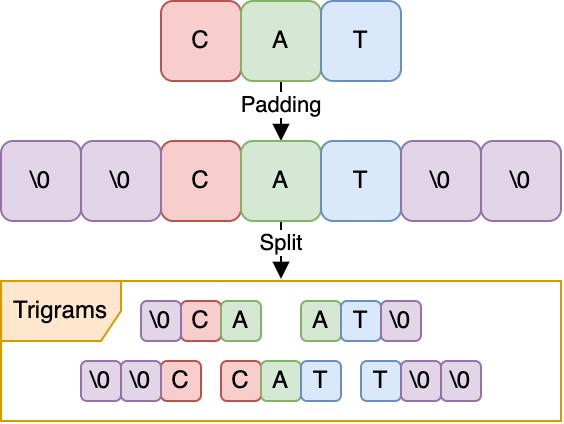

# Ngrammatic
[](https://github.com/compenguy/ngrammatic/actions)
[](https://crates.io/crates/ngrammatic)
[](https://docs.rs/ngrammatic/)
[](https://opensource.org/licenses/MIT)

Rust crate providing [n-gram-based](https://en.wikipedia.org/wiki/Word_n-gram_language_model) [fuzzy matching](https://en.wikipedia.org/wiki/Approximate_string_matching), with support for [Okapi BM25 TF-IDF](https://en.wikipedia.org/wiki/Okapi_BM25) search, cutting-edge memory efficient data structures such as [Rear Coded Lists](https://docs.rs/sux/0.3.1/sux/dict/rear_coded_list/struct.RearCodedList.html), [BVGraph](https://github.com/vigna/webgraph-rs) and [Elias-Fano](https://docs.rs/sux/latest/sux/dict/elias_fano/struct.EliasFano.html) baked in, plus [Rayon](https://github.com/rayon-rs/rayon)-based parallelism.

## Installation

This crate is available from [crates.io](https://crates.io/crates/ngrammatic).

To use it, either add it to your Cargo.toml or run `cargo add ngrammatic`.

```toml
[dependencies]
ngrammatic = "0.5.0"
```

## Usage examples
Depending on your use case, you may want to select different data structures and search algorithms. While in the [documentation](https://docs.rs/ngrammatic/) you can find more detailed information, here are some examples to get you started.

To make an informed choice for your use case, please do check out the [memory requirement benchmarks here](https://github.com/LucaCappelletti94/ngrammatic/tree/master/benchmarks) and the [time requirement benchmarks here](https://github.com/LucaCappelletti94/ngrammatic/tree/master/benches) which compare the different data structures and search algorithms.

### Basic usage
We will go in the details of the different data structures and search algorithms later in this README, but first let's get started with an example you can immediately run. In this case, we create a trigram index to search across the [`ANIMALS`] names list which we ship with the crate.

```rust
use ngrammatic::prelude::*;

// We create a corpus from the list of animals in parallel.
let corpus: Corpus<[&str; 699], TriGram<char>> = Corpus::par_from(ANIMALS);

// We setup the search configuration
let search_config = NgramSearchConfig::default()
    .set_minimum_similarity_score(0.3).unwrap()
    .set_maximum_number_of_results(5);

// We search for a word similar to "catt"
let search_results: Vec<SearchResult<&&str, f32>> = corpus.ngram_search("Cattos", search_config);

assert!(!search_results.is_empty());

// We print the search results
for search_result in search_results {
    println!("{}: {}", search_result.key(), search_result.score());
}
```

### Text normalization
Natural language processing is notoriously difficult, and one of the first steps is to normalize the text. You can add any normalization you want by creating new struct markers that implement [`std::convert::AsRef`] to the type of the keys you want to use, which may be for instance [`str`] or [`String`]. In this case, we use the [`Lowercase`] struct marker to normalize the text to lowercase. By default, text represented in [`str`] or [`String`] is padded with [`NULL`](https://theasciicode.com.ar/ascii-control-characters/null-character-ascii-code-0.html) characters to ensure that the n-grams minimum length is respected by default, we drop all non-alphanumeric characters, remove duplicated spaces and trim both spaces and [`NULL`](https://theasciicode.com.ar/ascii-control-characters/null-character-ascii-code-0.html) characters from the sides of the text. You can use struct markers to customize the normalization process to remove or add any other normalization steps you may need.

```rust
use ngrammatic::prelude::*;

// We build the corpus sequentially - there is no particular reason to use one or ther other
// in this example, just to show that you can use both.
let corpus: Corpus<&[&str; 699], TriGram<char>, Lowercase> = Corpus::from(&ANIMALS);

// We setup the search configuration
let search_config = NgramSearchConfig::default()
    .set_minimum_similarity_score(0.3).unwrap()
    .set_maximum_number_of_results(5);

// We search for a word similar to "catt"
let search_results: Vec<SearchResult<&&str, f32>> = corpus.ngram_search("Cattos", search_config);

assert!(!search_results.is_empty());

// We print the search results
for search_result in search_results {
    println!("{}: {}", search_result.key(), search_result.score());
}
```

#### ASCII characters
If you are working with ASCII characters or want to remove the UTF8 characters from your text, you can use the [`ASCIIChar`] struct as your gram to ensure that the text is normalized to ASCII characters. Note that a [`char`] in Rust is represented by a [`u32`], while an ASCII character is represented by a [`u8`]. This means that by using the [`ASCIIChar`] as your gram, your will reduce by default the memory usage of your n-grams by 4 times.

```rust
use ngrammatic::prelude::*;

let corpus: Corpus<&[&str; 699], TriGram<ASCIIChar>, Lowercase<str>> = Corpus::par_from(&ANIMALS);

// We setup the search configuration
let search_config = NgramSearchConfig::default()
    .set_minimum_similarity_score(0.3).unwrap()
    .set_maximum_number_of_results(5);

// We search for a word similar to "catt"
let search_results: Vec<SearchResult<&&str, f32>> = corpus.ngram_search("Cattos", search_config);

assert!(!search_results.is_empty());

// We print the search results
for search_result in search_results {
    println!("{}: {}", search_result.key(), search_result.score());
}
```

#### Using bytes
If you are working with bytes, you can use [`u8`] as your gram. Note that this means that you can make n-grams out of anything that you can represent as a sequence of bytes. By default, [`u8`] are padded with zeros to ensure that the n-grams minimum length is respected.

```rust
use ngrammatic::prelude::*;

let corpus: Corpus<&[&str; 699], TriGram<u8>, Lowercase<str>> = Corpus::par_from(&ANIMALS);

// We setup the search configuration
let search_config = NgramSearchConfig::default()
    .set_minimum_similarity_score(0.3).unwrap()
    .set_maximum_number_of_results(5);

// We search for a word similar to "catt"
let search_results: Vec<SearchResult<&&str, f32>> = corpus.ngram_search("Cattos", search_config);

assert!(!search_results.is_empty());

// We print the search results
for search_result in search_results {
    println!("{}: {}", search_result.key(), search_result.score());
}
```

### What are n-grams?
An n-gram is a contiguous sequence of n items from a given sequence. In the case of text, the n-gram are commonly used to create a sequence of characters. Concretely, in this crate, we use arrays for the n-grams, which means that the n-grams are fixed length sequences of items. In the following picture, we illustrate how the word "cat" is transformed into trigrams.



#### Which n-grams are available?
While you can create your own n-grams by implementing the [`Ngram`] trait, we provide ngrams from size one to eight. The n-grams are named as follows: [`UniGram`], [`BiGram`], [`TriGram`], [`TetraGram`], [`PentaGram`], [`HexaGram`], [`HeptaGram`] and [`OctaGram`]. The reason we stop at eight is that eight is the maximum number of [`u8`] can be stored in a [`u64`], and generally speaking using more than eight characters for n-grams is already overkill for most use cases.

Here follows an example of how you can create corpus with different n-grams:

```rust
use ngrammatic::prelude::*;

let corpus: Corpus<&[&str; 699], UniGram<char>> = Corpus::par_from(&ANIMALS);
let corpus: Corpus<&[&str; 699], BiGram<char>> = Corpus::par_from(&ANIMALS);
let corpus: Corpus<&[&str; 699], TriGram<char>> = Corpus::par_from(&ANIMALS);
let corpus: Corpus<&[&str; 699], TetraGram<char>> = Corpus::par_from(&ANIMALS);
let corpus: Corpus<&[&str; 699], PentaGram<char>> = Corpus::par_from(&ANIMALS);
let corpus: Corpus<&[&str; 699], HexaGram<char>> = Corpus::par_from(&ANIMALS);
let corpus: Corpus<&[&str; 699], HeptaGram<char>> = Corpus::par_from(&ANIMALS);
let corpus: Corpus<&[&str; 699], OctaGram<char>> = Corpus::par_from(&ANIMALS);
```

#### Which n-gram should I use?
The optimal size for ngrams can vary depending on the specific task and dataset you're working with. Generally, smaller ngram sizes (like [`UniGram`] or [`BiGram`]) capture more local patterns and are useful for tasks like text classification or sentiment analysis. On the other hand, larger ngram sizes (like [`TriGram`] or higher) capture more global patterns and are useful for tasks like machine translation or language modeling.

In practice, it's often beneficial to experiment with different ngram sizes to see what works best for your particular application. Keep in mind that larger ngram sizes can lead to sparsity issues, especially with smaller datasets, while smaller ngram sizes may not capture enough context for certain tasks. So, it's often a trade-off between capturing enough context and avoiding sparsity.

### Search algorithms
This struct provide two search algorithms: n-gram search and Okapi BM25 TF-IDF search. The n-gram search is a fuzzy search algorithm that uses n-grams to find similar strings in a corpus. The Okapi BM25 TF-IDF search is a more advanced search algorithm that uses term frequency-inverse document frequency (TF-IDF) to rank search results based on their relevance to a query. You can also combine the weighting schema from the two search algorithms. The search algorithms are implemented as methods on the [`Corpus`] struct. All search algorithms come with search configurations, and are available in both sequential and parallel versions.

#### N-gram search
The n-gram search algorithm is a fuzzy search algorithm that uses n-grams to find similar strings in a corpus. The algorithm works by creating n-grams from the query string and comparing them to the n-grams in the corpus. The search results are ranked based on the [Jaccard-like similarity](https://en.wikipedia.org/wiki/Jaccard_index) between the query string and the strings in the corpus. The n-gram search algorithm is implemented as the [`ngram_search`] and [`ngram_par_search`] methods on the [`Corpus`] struct, with the configuration provided by the [`NgramSearchConfig`] struct. By default, these method use a warp of 2.

```rust
use ngrammatic::prelude::*;

let corpus: Corpus<&[&str; 699], TriGram<char>, Lowercase> = Corpus::par_from(&ANIMALS);

let search_config = NgramSearchConfig::default()
    .set_minimum_similarity_score(0.3).unwrap()
    .set_maximum_number_of_results(5);

let search_results: Vec<SearchResult<&&str, f32>> = corpus.ngram_search("Cattos", search_config);

assert!(!search_results.is_empty());

for search_result in search_results {
    println!("{}: {}", search_result.key(), search_result.score());
}

let search_results: Vec<SearchResult<&&str, f32>> = corpus.ngram_par_search("Cattos", search_config);

assert!(!search_results.is_empty());

for search_result in search_results {
    println!("{}: {}", search_result.key(), search_result.score());
}
```

##### Warp
The warp n-gram search algorithm uses a parameter called warp which defines the expontiation of the numerator and denumerator of the Jaccard-like similarity. The warp parameter is useful to give increase the similarity of shorter string pairs. The warp parameter is defined in the [`NgramSearchConfig`] struct. This search algorithm is implemented as the [`ngram_search_with_warp`] and [`ngram_par_search_with_warp`] methods on the [`Corpus`] struct. Note that using an integer warp is faster than using a float warp as we can use the [`powi`] method instead of the [`powf`] method.

```rust
use ngrammatic::prelude::*;

let corpus: Corpus<&[&str; 699], TriGram<char>, Lowercase> = Corpus::par_from(&ANIMALS);

let search_config = NgramSearchConfig::default()
    .set_minimum_similarity_score(0.3).unwrap()
    .set_maximum_number_of_results(5)
    .set_warp(1.5).unwrap();

let search_results: Vec<SearchResult<&&str, f32>> = corpus.ngram_search_with_warp("Cattos", search_config);

assert!(!search_results.is_empty());

for search_result in search_results {
    println!("{}: {}", search_result.key(), search_result.score());
}

let search_results: Vec<SearchResult<&&str, f32>> = corpus.ngram_par_search_with_warp("Cattos", search_config);

assert!(!search_results.is_empty());

for search_result in search_results {
    println!("{}: {}", search_result.key(), search_result.score());
}
```

#### Okapi BM25 TF-IDF search
The [Okapi BM25 TF-IDF](https://en.wikipedia.org/wiki/Okapi_BM25) search algorithm is a more advanced ranking algorithm that uses [term frequency-inverse document frequency (TF-IDF)](https://en.wikipedia.org/wiki/Tf%E2%80%93idf) to rank search results based on their relevance to a query. The algorithm works by calculating the TF-IDF score for each term in the query and the documents in the corpus, and then ranking the documents based on their TF-IDF scores. The Okapi BM25 TF-IDF search algorithm is implemented as the [`tf_idf_search`] and [`tf_idf_par_search`] methods on the [`Corpus`] struct, with the configuration provided by the [`TFIDFSearchConfig`] struct.

```rust
use ngrammatic::prelude::*;

let corpus: Corpus<&[&str; 699], TriGram<char>, Lowercase> = Corpus::par_from(&ANIMALS);

let search_config = TFIDFSearchConfig::default()
    .set_minimum_similarity_score(0.3).unwrap()
    .set_maximum_number_of_results(5);

let search_results: Vec<SearchResult<&&str, f32>> = corpus.tf_idf_search("Cattos", search_config);

assert!(!search_results.is_empty());

for search_result in search_results {
    println!("{}: {}", search_result.key(), search_result.score());
}

let search_results: Vec<SearchResult<&&str, f32>> = corpus.tf_idf_par_search("Cattos", search_config);

assert!(!search_results.is_empty());

for search_result in search_results {
    println!("{}: {}", search_result.key(), search_result.score());
}
```

#### Combined search
You can use the two combined weighting schema to combine the results of the n-gram search and the Okapi BM25 TF-IDF search. The combined search algorithm is implemented as the [`warped_tf_idf_search`] and [`warped_tf_idf_par_search`] methods on the [`Corpus`] struct, with the configuration provided by the [`TFIDFSearchConfig`] struct.

```rust
use ngrammatic::prelude::*;

let corpus: Corpus<&[&str; 699], TriGram<char>, Lowercase> = Corpus::par_from(&ANIMALS);

let search_config = TFIDFSearchConfig::default()
    .set_minimum_similarity_score(0.3).unwrap()
    .set_warp(1.5).unwrap()
    .set_maximum_number_of_results(5);

let search_results: Vec<SearchResult<&&str, f32>> = corpus.warped_tf_idf_search("Cattos", search_config);

assert!(!search_results.is_empty());

for search_result in search_results {
    println!("{}: {}", search_result.key(), search_result.score());
}

let search_results: Vec<SearchResult<&&str, f32>> = corpus.warped_tf_idf_par_search("Cattos", search_config);

assert!(!search_results.is_empty());

for search_result in search_results {
    println!("{}: {}", search_result.key(), search_result.score());
}
```

### BVGraph or Webgraph
[Webgraph](https://github.com/vigna/webgraph-rs/) is a Rust library for succinctly representing graphs ([the very interesting paper describing this effort is available here](https://hal.science/hal-04494627/document)). The BVGraph is an efficient representation of a graph that uses a bit vector to represent the adjacency list of each node. The BVGraph is a compressed representation of the graph that uses substantially less memory than a traditional adjacency list or adjacency matrix.

By default, this crate uses a combination of [Elias-Fano](https://core.ac.uk/download/pdf/79617357.pdf) and [bit vectors](https://en.wikipedia.org/wiki/Bit_array) to store efficiently the graph representing the connections between the documents and the n-grams. In some settings, you may want to use instead the BVGraph representation, which is [somewhat slower](https://github.com/LucaCappelletti94/ngrammatic/tree/master/benches) but [it employs significantly less memory](https://github.com/LucaCappelletti94/ngrammatic/blob/master/benchmarks/README.md).

Here follows an example of how you can create a corpus with the BVGraph representation:

```rust
use ngrammatic::prelude::*;

let corpus: Corpus<&[&str; 699], TriGram<char>, Lowercase> = Corpus::par_from(&ANIMALS);
let corpus_webgraph: Corpus<&[&str; 699], TriGram<char>, Lowercase<str>, BiWebgraph> =
        Corpus::try_from(corpus).unwrap();

```

#### Using native compilation targets
The [Webgraph](https://github.com/vigna/webgraph-rs/) rust library benefits significantly from compiling the code to the native target. This is because the Webgraph library extensively uses [SIMD instructions](https://en.wikipedia.org/wiki/Single_instruction,_multiple_data) to speed up the computation. To compile the code to the native target, you can use the following command:

```bash
RUSTFLAGS="-C target-cpu=native" cargo build --release
```

### Rear Coded List
The [Rear Coded List](https://docs.rs/sux/0.3.1/sux/dict/rear_coded_list/struct.RearCodedList.html) is a memory efficient data structure to store an immutable list of strings compressed by prefix omission via rear coding. Prefix omission compresses a list of strings omitting the common prefixes of consecutive strings. To do so, it stores the length of what remains after the common prefix (hence, rear coding). It is usually applied to lists strings sorted in ascending order. The encoding is done in blocks of k strings: in each block the first string is encoded without compression, wheres the other strings are encoded with the common prefix removed.

Here follows an example of how you can create a corpus with the Rear Coded List representation:

```rust
use ngrammatic::prelude::*;
use rayon::slice::ParallelSliceMut;

let mut animals: Vec<&str> = ANIMALS.into();
animals.par_sort_unstable();

let mut builder = RearCodedListBuilder::new(8);
for animal in animals {
    builder.push(&animal);
}
let rear_coded_list: RearCodedList = builder.build();

let corpus: Corpus<RearCodedList, TriGram<char>, Lowercase> = Corpus::par_from(rear_coded_list);

// You can still convert this into a Webgraph representation to save even more memory
let corpus_webgraph: Corpus<RearCodedList, TriGram<char>, Lowercase<str>, BiWebgraph> =
        Corpus::try_from(corpus).unwrap();

// We define a search config
let search_config = NgramSearchConfig::default()
    .set_minimum_similarity_score(0.3).unwrap()
    .set_maximum_number_of_results(5);

// And now you can use the corpus as you would normally do, with the catch that the search
// results will necessarily be of type SearchResult<String, f32> instead of references since
// the RearCodedList cannot provide references to the strings.
let search_results: Vec<SearchResult<String, f32>> = corpus_webgraph.ngram_search("Cattos", search_config);

assert!(!search_results.is_empty());

for search_result in search_results {
    println!("{}: {}", search_result.key(), search_result.score());
}

```

### Trie
A [Trie](https://github.com/laysakura/trie-rs) is a tree-like data structure that stores a dynamic set of strings. It is a memory-efficient way to store a large number of strings, and it is particularly useful for searching for strings with a common prefix. This data structure is avilable under the `trie-rs` feature.

Here follows an example of how you can create a corpus with the Trie representation:

```rust
#[cfg(feature = "trie-rs")] {
use ngrammatic::prelude::*;

let trie = Trie::from_iter(ANIMALS);
let corpus: Corpus<Trie<u8>, TriGram<u8>, Lowercase> = Corpus::par_from(trie);

// We define a search config
let search_config = NgramSearchConfig::default()
    .set_minimum_similarity_score(0.3).unwrap()
    .set_maximum_number_of_results(5);

// And now you can use the corpus as you would normally do, with the catch that the search
// results will necessarily be of type SearchResult<String, f32> instead of references since
// the RearCodedList cannot provide references to the strings.
let search_results: Vec<SearchResult<String, f32>> = corpus_webgraph.ngram_search("Cattos", search_config);

assert!(!search_results.is_empty());

for search_result in search_results {
    println!("{}: {}", search_result.key(), search_result.score());
}

}
```

### MemDbg support
[MemDbg](https://github.com/zommiommy/mem_dbg-rs) is a rust library that measures and breaks down the memory requirements of structs. It is available across most of the data structures used in this crate, with the exception of webgraph (there it is only available in the nightly version of webgraph, they are still working on it). Here follows a couple of examples on using MemDbg on the version using the [Rear Coded List](https://docs.rs/sux/0.3.1/sux/dict/rear_coded_list/struct.RearCodedList.html), the [trie](https://github.com/laysakura/trie-rs) and the version using a simple vector. In both, we use the taxons dataset, which contains about 2.5 million species from NCBI taxons.

First, the version using a simple vector:


```rust
use ngrammatic::prelude::*;
use mem_dbg::*;

/// Returns an iterator over the taxons in the corpus.
fn iter_taxons() -> impl Iterator<Item = String> {
    use flate2::read::GzDecoder;
    use std::fs::File;
    use std::io::{BufRead, BufReader};

    let file = File::open("./benchmarks/taxons.csv.gz").unwrap();
    let reader = BufReader::new(GzDecoder::new(file));
    reader.lines().map(|line| line.unwrap())
}

let mut animals: Vec<String> = iter_taxons().collect();

let corpus: Corpus<Vec<String>, TriGram<char>, Lowercase> = Corpus::par_from(animals);

corpus.mem_dbg(DbgFlags::default() | DbgFlags::CAPACITY | DbgFlags::HUMANIZE).unwrap();
```

This script outputs:

```text
513.5 MB 100.00% ⏺: ngrammatic::corpus::Corpus<alloc::vec::Vec<alloc::string::String>, [char; 3], ngrammatic::traits::char_normalizer::Lowercase>
170.0 MB  33.11% ├╴keys: alloc::vec::Vec<alloc::string::String>
565.4 kB   0.11% ├╴ngrams: alloc::vec::Vec<[char; 3]>
342.9 MB  66.78% ├╴graph: ngrammatic::bit_field_bipartite_graph::WeightedBitFieldBipartiteGraph
10.53 MB   2.05% │ ├╴srcs_to_dsts_weights: ngrammatic::weights::Weights
8.389 MB   1.63% │ │ ├╴reader_factory: ngrammatic::weights::CursorReaderFactory
8.389 MB   1.63% │ │ │ ╰╴data: alloc::vec::Vec<u8>
2.137 MB   0.42% │ │ ├╴offsets: sux::dict::elias_fano::EliasFano<sux::rank_sel::select_fixed2::SelectFixed2>
    8  B   0.00% │ │ │ ├╴u: usize
    8  B   0.00% │ │ │ ├╴n: usize
    8  B   0.00% │ │ │ ├╴l: usize
1.286 MB   0.25% │ │ │ ├╴low_bits: sux::bits::bit_field_vec::BitFieldVec
1.286 MB   0.25% │ │ │ │ ├╴data: alloc::vec::Vec<usize>
    8  B   0.00% │ │ │ │ ├╴bit_width: usize
    8  B   0.00% │ │ │ │ ├╴mask: usize
    8  B   0.00% │ │ │ │ ╰╴len: usize
851.3 kB   0.17% │ │ │ ╰╴high_bits: sux::rank_sel::select_fixed2::SelectFixed2
750.8 kB   0.15% │ │ │   ├╴bits: sux::bits::bit_vec::CountBitVec
750.8 kB   0.15% │ │ │   │ ├╴data: alloc::vec::Vec<usize>
    8  B   0.00% │ │ │   │ ├╴len: usize
    8  B   0.00% │ │ │   │ ╰╴number_of_ones: usize
100.5 kB   0.02% │ │ │   ╰╴inventory: alloc::vec::Vec<u64>
    8  B   0.00% │ │ ├╴num_nodes: usize
    8  B   0.00% │ │ ╰╴num_weights: usize
2.250 MB   0.44% │ ├╴srcs_offsets: sux::dict::elias_fano::EliasFano<sux::rank_sel::select_fixed2::SelectFixed2>
    8  B   0.00% │ │ ├╴u: usize
    8  B   0.00% │ │ ├╴n: usize
    8  B   0.00% │ │ ├╴l: usize
1.286 MB   0.25% │ │ ├╴low_bits: sux::bits::bit_field_vec::BitFieldVec
1.286 MB   0.25% │ │ │ ├╴data: alloc::vec::Vec<usize>
    8  B   0.00% │ │ │ ├╴bit_width: usize
    8  B   0.00% │ │ │ ├╴mask: usize
    8  B   0.00% │ │ │ ╰╴len: usize
964.8 kB   0.19% │ │ ╰╴high_bits: sux::rank_sel::select_fixed2::SelectFixed2
864.3 kB   0.17% │ │   ├╴bits: sux::bits::bit_vec::CountBitVec
864.3 kB   0.17% │ │   │ ├╴data: alloc::vec::Vec<usize>
    8  B   0.00% │ │   │ ├╴len: usize
    8  B   0.00% │ │   │ ╰╴number_of_ones: usize
100.5 kB   0.02% │ │   ╰╴inventory: alloc::vec::Vec<u64>
75.30 kB   0.01% │ ├╴dsts_offsets: sux::dict::elias_fano::EliasFano<sux::rank_sel::select_fixed2::SelectFixed2>
    8  B   0.00% │ │ ├╴u: usize
    8  B   0.00% │ │ ├╴n: usize
    8  B   0.00% │ │ ├╴l: usize
58.94 kB   0.01% │ │ ├╴low_bits: sux::bits::bit_field_vec::BitFieldVec
58.92 kB   0.01% │ │ │ ├╴data: alloc::vec::Vec<usize>
    8  B   0.00% │ │ │ ├╴bit_width: usize
    8  B   0.00% │ │ │ ├╴mask: usize
    8  B   0.00% │ │ │ ╰╴len: usize
16.33 kB   0.00% │ │ ╰╴high_bits: sux::rank_sel::select_fixed2::SelectFixed2
14.42 kB   0.00% │ │   ├╴bits: sux::bits::bit_vec::CountBitVec
14.40 kB   0.00% │ │   │ ├╴data: alloc::vec::Vec<usize>
    8  B   0.00% │ │   │ ├╴len: usize
    8  B   0.00% │ │   │ ╰╴number_of_ones: usize
1.912 kB   0.00% │ │   ╰╴inventory: alloc::vec::Vec<u64>
191.1 MB  37.22% │ ├╴srcs_to_dsts: sux::bits::bit_field_vec::BitFieldVec
191.1 MB  37.22% │ │ ├╴data: alloc::vec::Vec<usize>
    8  B   0.00% │ │ ├╴bit_width: usize
    8  B   0.00% │ │ ├╴mask: usize
    8  B   0.00% │ │ ╰╴len: usize
139.0 MB  27.07% │ ╰╴dsts_to_srcs: sux::bits::bit_field_vec::BitFieldVec
139.0 MB  27.07% │   ├╴data: alloc::vec::Vec<usize>
    8  B   0.00% │   ├╴bit_width: usize
    8  B   0.00% │   ├╴mask: usize
    8  B   0.00% │   ╰╴len: usize
    8  B   0.00% ├╴average_key_length: f64
    0  B   0.00% ╰╴_phantom: core::marker::PhantomData<ngrammatic::traits::char_normalizer::Lowercase>
```


Then, the version using the [Rear Coded List](https://docs.rs/sux/0.3.1/sux/dict/rear_coded_list/struct.RearCodedList.html):

```rust
use ngrammatic::prelude::*;
use rayon::slice::ParallelSliceMut;
use mem_dbg::*;

/// Returns an iterator over the taxons in the corpus.
fn iter_taxons() -> impl Iterator<Item = String> {
    use flate2::read::GzDecoder;
    use std::fs::File;
    use std::io::{BufRead, BufReader};

    let file = File::open("./benchmarks/taxons.csv.gz").unwrap();
    let reader = BufReader::new(GzDecoder::new(file));
    reader.lines().map(|line| line.unwrap())
}

let mut animals: Vec<String> = iter_taxons().collect();
animals.par_sort_unstable();

let mut builder = RearCodedListBuilder::new(8);
for animal in animals {
    builder.push(&animal);
}

let rear_coded_list: RearCodedList = builder.build();

let corpus: Corpus<RearCodedList, TriGram<char>, Lowercase> = Corpus::par_from(rear_coded_list);

corpus.mem_dbg(DbgFlags::default() | DbgFlags::CAPACITY | DbgFlags::HUMANIZE).unwrap();
```

This version instead outputs:

```text
381.2 MB 100.00% ⏺: ngrammatic::corpus::Corpus<sux::dict::rear_coded_list::RearCodedList, [char; 3], ngrammatic::traits::char_normalizer::Lowercase>
37.75 MB   9.90% ├╴keys: sux::dict::rear_coded_list::RearCodedList
    8  B   0.00% │ ├╴k: usize
    8  B   0.00% │ ├╴len: usize
    1  B   0.00% │ ├╴is_sorted: bool
33.55 MB   8.80% │ ├╴data: alloc::vec::Vec<u8>
4.194 MB   1.10% │ ╰╴pointers: alloc::vec::Vec<usize>
565.4 kB   0.15% ├╴ngrams: alloc::vec::Vec<[char; 3]>
342.9 MB  89.95% ├╴graph: ngrammatic::bit_field_bipartite_graph::WeightedBitFieldBipartiteGraph
10.53 MB   2.76% │ ├╴srcs_to_dsts_weights: ngrammatic::weights::Weights
8.389 MB   2.20% │ │ ├╴reader_factory: ngrammatic::weights::CursorReaderFactory
8.389 MB   2.20% │ │ │ ╰╴data: alloc::vec::Vec<u8>
2.137 MB   0.56% │ │ ├╴offsets: sux::dict::elias_fano::EliasFano<sux::rank_sel::select_fixed2::SelectFixed2>
    8  B   0.00% │ │ │ ├╴u: usize
    8  B   0.00% │ │ │ ├╴n: usize
    8  B   0.00% │ │ │ ├╴l: usize
1.286 MB   0.34% │ │ │ ├╴low_bits: sux::bits::bit_field_vec::BitFieldVec
1.286 MB   0.34% │ │ │ │ ├╴data: alloc::vec::Vec<usize>
    8  B   0.00% │ │ │ │ ├╴bit_width: usize
    8  B   0.00% │ │ │ │ ├╴mask: usize
    8  B   0.00% │ │ │ │ ╰╴len: usize
851.3 kB   0.22% │ │ │ ╰╴high_bits: sux::rank_sel::select_fixed2::SelectFixed2
750.8 kB   0.20% │ │ │   ├╴bits: sux::bits::bit_vec::CountBitVec
750.8 kB   0.20% │ │ │   │ ├╴data: alloc::vec::Vec<usize>
    8  B   0.00% │ │ │   │ ├╴len: usize
    8  B   0.00% │ │ │   │ ╰╴number_of_ones: usize
100.5 kB   0.03% │ │ │   ╰╴inventory: alloc::vec::Vec<u64>
    8  B   0.00% │ │ ├╴num_nodes: usize
    8  B   0.00% │ │ ╰╴num_weights: usize
2.250 MB   0.59% │ ├╴srcs_offsets: sux::dict::elias_fano::EliasFano<sux::rank_sel::select_fixed2::SelectFixed2>
    8  B   0.00% │ │ ├╴u: usize
    8  B   0.00% │ │ ├╴n: usize
    8  B   0.00% │ │ ├╴l: usize
1.286 MB   0.34% │ │ ├╴low_bits: sux::bits::bit_field_vec::BitFieldVec
1.286 MB   0.34% │ │ │ ├╴data: alloc::vec::Vec<usize>
    8  B   0.00% │ │ │ ├╴bit_width: usize
    8  B   0.00% │ │ │ ├╴mask: usize
    8  B   0.00% │ │ │ ╰╴len: usize
964.8 kB   0.25% │ │ ╰╴high_bits: sux::rank_sel::select_fixed2::SelectFixed2
864.3 kB   0.23% │ │   ├╴bits: sux::bits::bit_vec::CountBitVec
864.3 kB   0.23% │ │   │ ├╴data: alloc::vec::Vec<usize>
    8  B   0.00% │ │   │ ├╴len: usize
    8  B   0.00% │ │   │ ╰╴number_of_ones: usize
100.5 kB   0.03% │ │   ╰╴inventory: alloc::vec::Vec<u64>
75.30 kB   0.02% │ ├╴dsts_offsets: sux::dict::elias_fano::EliasFano<sux::rank_sel::select_fixed2::SelectFixed2>
    8  B   0.00% │ │ ├╴u: usize
    8  B   0.00% │ │ ├╴n: usize
    8  B   0.00% │ │ ├╴l: usize
58.94 kB   0.02% │ │ ├╴low_bits: sux::bits::bit_field_vec::BitFieldVec
58.92 kB   0.02% │ │ │ ├╴data: alloc::vec::Vec<usize>
    8  B   0.00% │ │ │ ├╴bit_width: usize
    8  B   0.00% │ │ │ ├╴mask: usize
    8  B   0.00% │ │ │ ╰╴len: usize
16.33 kB   0.00% │ │ ╰╴high_bits: sux::rank_sel::select_fixed2::SelectFixed2
14.42 kB   0.00% │ │   ├╴bits: sux::bits::bit_vec::CountBitVec
14.40 kB   0.00% │ │   │ ├╴data: alloc::vec::Vec<usize>
    8  B   0.00% │ │   │ ├╴len: usize
    8  B   0.00% │ │   │ ╰╴number_of_ones: usize
1.912 kB   0.00% │ │   ╰╴inventory: alloc::vec::Vec<u64>
191.1 MB  50.12% │ ├╴srcs_to_dsts: sux::bits::bit_field_vec::BitFieldVec
191.1 MB  50.12% │ │ ├╴data: alloc::vec::Vec<usize>
    8  B   0.00% │ │ ├╴bit_width: usize
    8  B   0.00% │ │ ├╴mask: usize
    8  B   0.00% │ │ ╰╴len: usize
139.0 MB  36.45% │ ╰╴dsts_to_srcs: sux::bits::bit_field_vec::BitFieldVec
139.0 MB  36.45% │   ├╴data: alloc::vec::Vec<usize>
    8  B   0.00% │   ├╴bit_width: usize
    8  B   0.00% │   ├╴mask: usize
    8  B   0.00% │   ╰╴len: usize
    8  B   0.00% ├╴average_key_length: f64
    0  B   0.00% ╰╴_phantom: core::marker::PhantomData<ngrammatic::traits::char_normalizer::Lowercase>
```

And finally, the version using [trie](https://github.com/laysakura/trie-rs):

```rust
/// Returns an iterator over the taxons in the corpus.
fn iter_taxons() -> impl Iterator<Item = String> {
    use flate2::read::GzDecoder;
    use std::fs::File;
    use std::io::{BufRead, BufReader};

    let file = File::open("./benchmarks/taxons.csv.gz").unwrap();
    let reader = BufReader::new(GzDecoder::new(file));
    reader.lines().map(|line| line.unwrap())
}

#[cfg(feature = "trie-rs")] {
use ngrammatic::prelude::*;
use mem_dbg::*;

let trie = Trie::from_iter(iter_taxons());
let corpus: Corpus<Trie<u8>, TriGram<u8>, Lowercase> = Corpus::par_from(trie);

corpus.mem_dbg(DbgFlags::default() | DbgFlags::CAPACITY | DbgFlags::HUMANIZE).unwrap();

}
```

This script outputs:

```text
391.5 MB 100.00% ⏺: ngrammatic::corpus::Corpus<trie_rs::trie::trie_impl::Trie<u8>, [ngrammatic::traits::ascii_char::ASCIIChar; 3], ngrammatic::traits::char_normalizer::Lowercase>
49.91 MB  12.75% ├╴keys: trie_rs::trie::trie_impl::Trie<u8>
49.91 MB  12.75% │ ╰╴0: trie_rs::map::Trie<u8, ()>
16.36 MB   4.18% │   ├╴louds: louds_rs::louds::Louds
16.36 MB   4.18% │   │ ╰╴lbs: fid_rs::fid::Fid
3.873 MB   0.99% │   │   ├╴byte_vec: alloc::vec::Vec<u8>
    8  B   0.00% │   │   ├╴bit_len: u64
12.48 MB   3.19% │   │   ├╴chunks: fid_rs::fid::Chunks
12.48 MB   3.19% │   │   │ ├╴chunks: alloc::vec::Vec<fid_rs::fid::Chunk>
    8  B   0.00% │   │   │ ╰╴chunks_cnt: u64
4.128 kB   0.00% │   │   ╰╴table: fid_rs::internal_data_structure::popcount_table::PopcountTable
    1  B   0.00% │   │     ├╴bit_length: u8
4.120 kB   0.00% │   │     ╰╴table: alloc::vec::Vec<u8>
33.55 MB   8.57% │   ╰╴trie_labels: alloc::vec::Vec<trie_rs::map::TrieLabel<u8, ()>>
56.98 kB   0.01% ├╴ngrams: sux::dict::elias_fano::EliasFano<sux::rank_sel::select_fixed2::SelectFixed2>
    8  B   0.00% │ ├╴u: usize
    8  B   0.00% │ ├╴n: usize
    8  B   0.00% │ ├╴l: usize
41.27 kB   0.01% │ ├╴low_bits: sux::bits::bit_field_vec::BitFieldVec
41.25 kB   0.01% │ │ ├╴data: alloc::vec::Vec<usize>
    8  B   0.00% │ │ ├╴bit_width: usize
    8  B   0.00% │ │ ├╴mask: usize
    8  B   0.00% │ │ ╰╴len: usize
15.68 kB   0.00% │ ╰╴high_bits: sux::rank_sel::select_fixed2::SelectFixed2
13.77 kB   0.00% │   ├╴bits: sux::bits::bit_vec::CountBitVec
13.75 kB   0.00% │   │ ├╴data: alloc::vec::Vec<usize>
    8  B   0.00% │   │ ├╴len: usize
    8  B   0.00% │   │ ╰╴number_of_ones: usize
1.912 kB   0.00% │   ╰╴inventory: alloc::vec::Vec<u64>
341.6 MB  87.24% ├╴graph: ngrammatic::bit_field_bipartite_graph::WeightedBitFieldBipartiteGraph
10.51 MB   2.69% │ ├╴srcs_to_dsts_weights: ngrammatic::weights::Weights
8.389 MB   2.14% │ │ ├╴reader_factory: ngrammatic::weights::CursorReaderFactory
8.389 MB   2.14% │ │ │ ╰╴data: alloc::vec::Vec<u8>
2.125 MB   0.54% │ │ ├╴offsets: sux::dict::elias_fano::EliasFano<sux::rank_sel::select_fixed2::SelectFixed2>
    8  B   0.00% │ │ │ ├╴u: usize
    8  B   0.00% │ │ │ ├╴n: usize
    8  B   0.00% │ │ │ ├╴l: usize
1.278 MB   0.33% │ │ │ ├╴low_bits: sux::bits::bit_field_vec::BitFieldVec
1.278 MB   0.33% │ │ │ │ ├╴data: alloc::vec::Vec<usize>
    8  B   0.00% │ │ │ │ ├╴bit_width: usize
    8  B   0.00% │ │ │ │ ├╴mask: usize
    8  B   0.00% │ │ │ │ ╰╴len: usize
846.7 kB   0.22% │ │ │ ╰╴high_bits: sux::rank_sel::select_fixed2::SelectFixed2
746.8 kB   0.19% │ │ │   ├╴bits: sux::bits::bit_vec::CountBitVec
746.8 kB   0.19% │ │ │   │ ├╴data: alloc::vec::Vec<usize>
    8  B   0.00% │ │ │   │ ├╴len: usize
    8  B   0.00% │ │ │   │ ╰╴number_of_ones: usize
99.87 kB   0.03% │ │ │   ╰╴inventory: alloc::vec::Vec<u64>
    8  B   0.00% │ │ ├╴num_nodes: usize
    8  B   0.00% │ │ ╰╴num_weights: usize
2.238 MB   0.57% │ ├╴srcs_offsets: sux::dict::elias_fano::EliasFano<sux::rank_sel::select_fixed2::SelectFixed2>
    8  B   0.00% │ │ ├╴u: usize
    8  B   0.00% │ │ ├╴n: usize
    8  B   0.00% │ │ ├╴l: usize
1.278 MB   0.33% │ │ ├╴low_bits: sux::bits::bit_field_vec::BitFieldVec
1.278 MB   0.33% │ │ │ ├╴data: alloc::vec::Vec<usize>
    8  B   0.00% │ │ │ ├╴bit_width: usize
    8  B   0.00% │ │ │ ├╴mask: usize
    8  B   0.00% │ │ │ ╰╴len: usize
960.1 kB   0.25% │ │ ╰╴high_bits: sux::rank_sel::select_fixed2::SelectFixed2
860.2 kB   0.22% │ │   ├╴bits: sux::bits::bit_vec::CountBitVec
860.2 kB   0.22% │ │   │ ├╴data: alloc::vec::Vec<usize>
    8  B   0.00% │ │   │ ├╴len: usize
    8  B   0.00% │ │   │ ╰╴number_of_ones: usize
99.87 kB   0.03% │ │   ╰╴inventory: alloc::vec::Vec<u64>
75.26 kB   0.02% │ ├╴dsts_offsets: sux::dict::elias_fano::EliasFano<sux::rank_sel::select_fixed2::SelectFixed2>
    8  B   0.00% │ │ ├╴u: usize
    8  B   0.00% │ │ ├╴n: usize
    8  B   0.00% │ │ ├╴l: usize
58.94 kB   0.02% │ │ ├╴low_bits: sux::bits::bit_field_vec::BitFieldVec
58.92 kB   0.02% │ │ │ ├╴data: alloc::vec::Vec<usize>
    8  B   0.00% │ │ │ ├╴bit_width: usize
    8  B   0.00% │ │ │ ├╴mask: usize
    8  B   0.00% │ │ │ ╰╴len: usize
16.30 kB   0.00% │ │ ╰╴high_bits: sux::rank_sel::select_fixed2::SelectFixed2
14.38 kB   0.00% │ │   ├╴bits: sux::bits::bit_vec::CountBitVec
14.37 kB   0.00% │ │   │ ├╴data: alloc::vec::Vec<usize>
    8  B   0.00% │ │   │ ├╴len: usize
    8  B   0.00% │ │   │ ╰╴number_of_ones: usize
1.912 kB   0.00% │ │   ╰╴inventory: alloc::vec::Vec<u64>
190.3 MB  48.61% │ ├╴srcs_to_dsts: sux::bits::bit_field_vec::BitFieldVec
190.3 MB  48.61% │ │ ├╴data: alloc::vec::Vec<usize>
    8  B   0.00% │ │ ├╴bit_width: usize
    8  B   0.00% │ │ ├╴mask: usize
    8  B   0.00% │ │ ╰╴len: usize
138.4 MB  35.35% │ ╰╴dsts_to_srcs: sux::bits::bit_field_vec::BitFieldVec
138.4 MB  35.35% │   ├╴data: alloc::vec::Vec<usize>
    8  B   0.00% │   ├╴bit_width: usize
    8  B   0.00% │   ├╴mask: usize
    8  B   0.00% │   ╰╴len: usize
    8  B   0.00% ├╴average_key_length: f64
    0  B   0.00% ╰╴_phantom: core::marker::PhantomData<ngrammatic::traits::char_normalizer::Lowercase>
```

In this use case, the use of RCL allows us to save about 132 MB of memory, a non-negligible amount of memory. The RCL beats the Trie data structure in terms of memory usage, and even results faster in terms of build and search times.

## Contributing
Contributions from the community are highly appreciated and can help improve this project. If you have any suggestions, feature requests, or bugs to report, please open an issue on GitHub. Additionally, if you want to contribute to the project, you can open a pull request with your proposed changes. Before making any substantial changes, please discuss them with the project maintainers in the issue tracker.

If you appreciate this project and would like to support its development, you can star the repository on GitHub. 
